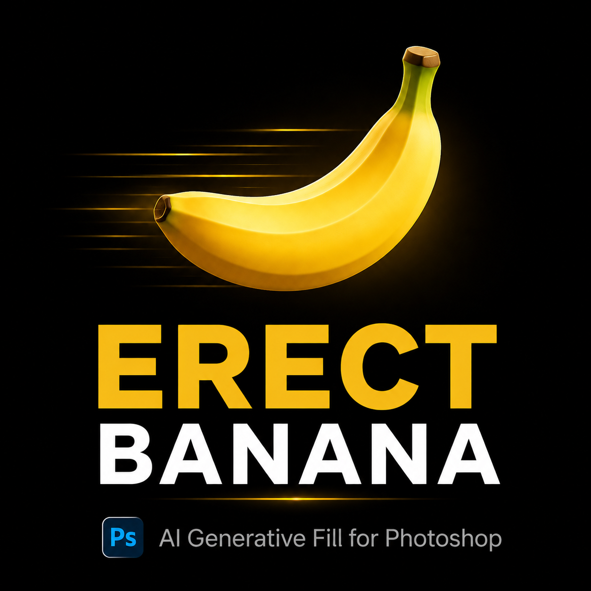

# Erect Banana

**AI Generative Fill — natively inside Photoshop. Powered by Google Gemini.**

**[Buy now — $15](https://junshaon.gumroad.com/l/erect-banana)** ·
[Download installer](https://github.com/shuaige-dev/erect-banana/releases/latest) ·
[Email support](mailto:junshaonan@outlook.com) ·
[Demo video](https://youtu.be/jNrBVeFAguQ)

[中文版 ↓](#中文版)

---

## What it does

Generative Fill, natively inside Photoshop. No app switching, no exporting, no manual uploads.
Draw a selection, type a prompt, click Generate. The result is composited directly into your layer.

Powered by Google's **Gemini 2.5 Flash Image** (a.k.a. "Nano Banana") — currently one of the fastest and highest-quality models for inpainting and image editing.

## Why this exists

- Adobe Firefly is **slow**, **expensive** ($60+/year), and **not available in every region**.
- DALL-E / Midjourney require a copy-paste workflow that breaks creative flow.
- Erect Banana runs natively in PS via the UXP plugin system. **No app switching, ever.**

## Features

- One-click generative fill on any selection shape
- **BYOK** (Bring Your Own Key) — uses your own Google AI Studio API key
  - Your images never touch our servers
  - You pay Google directly — no markup, no middleman
  - Free tier available (15 requests/min on Google)
- Works with both Adobe-distributed Photoshop and standalone installs
- Chinese + English UI

## Requirements

- Photoshop 2024 or later (v25.0+)
- Windows 10/11 (64-bit) — macOS planned for v2.0
- A free Google AI Studio API key (1-minute signup at <https://aistudio.google.com/apikey>)

## Pricing

| | Founders' price | After v2.0 |
|---|---|---|
| **License (1 machine)** | **$15** | $39 |

One-time purchase. No subscription, no per-generation fee. Lifetime updates within the v1.x line.

Buy at:
- **International** → [Gumroad](https://junshaon.gumroad.com/l/erect-banana) — instant key delivery
- **中国大陆** → 闲鱼搜 "硬邦邦的香蕉" — ¥29-39

## Download

The installer is on the [Releases page](https://github.com/shuaige-dev/erect-banana/releases/latest). **A license key is required to activate** — purchase above first.

| File | For |
|---|---|
| `ErectBanana-X.Y.Z-Setup-Pro.exe` | Standard Adobe Photoshop |
| `ErectBanana(Portable)-X.Y.Z-Setup-Pro.exe` | Standalone / portable PS |

China mirror (faster from mainland): **[Gitee Releases](https://gitee.com/shuaige-dev/erect-banana/releases)**

## Install (90 seconds)

1. **Buy a license key** at [Gumroad ($15)](https://junshaon.gumroad.com/l/erect-banana) — delivered to your email instantly
2. Download `ErectBanana-X.Y.Z-Setup-Pro.exe` from the Releases page
3. Run the installer (accept defaults)
4. Get a free Google API key at <https://aistudio.google.com/apikey>
5. Open Photoshop → `Plugins` → `Erect Banana` → paste your **license key**, then your **Google API key**
6. Make a selection, type a prompt, click Generate

Questions or problems? Email **<junshaonan@outlook.com>** — usually replied within 24h.

---

## 中文版

**硬邦邦的香蕉** —— Photoshop 原生 AI 生成填充插件，底层用 Google Gemini 2.5 Flash Image（"Nano Banana"）。

### 它能做什么

不切应用、不导出、不上传。框选 → 输 prompt → 点生成，结果直接合成到当前图层。

底层用 Google 最新的 Gemini 2.5 Flash Image，目前公认对图像修补/扩图任务最快、效果最好的通用模型之一。

### 为什么做这个

- Adobe Firefly **慢**、**贵**（¥1500+/年）、**国内还不一定能用**
- DALL-E / Midjourney 要复制粘贴来回切，打断创作思路
- 硬邦邦的香蕉是 PS UXP 插件，**永远不需要离开 PS**

### 功能

- 一键 AI 生成填充，任意选区形状都支持
- **BYOK**（自带 API key）：用你自己的 Google AI Studio key
  - 图片不经过我们的服务器
  - 你直接付钱给 Google，我们不抽成
  - 有免费额度（15 次/分钟）
- 支持正版 PS 和便携版 PS
- 中英双语界面

### 系统要求

- Photoshop 2024 或更高（v25.0+）
- Windows 10/11（64 位），Mac 版本视销量再做
- Google AI Studio API key（免费可用，<https://aistudio.google.com/apikey> 注册 1 分钟）

### 价格

| | 首发价 | v2.0 之后 |
|---|---|---|
| **License（1 台机器）** | **¥29-39** | ¥99 |

一次买断。无订阅、无次数限制。v1.x 系列内终身免费更新。

购买渠道：
- **国内**：闲鱼搜 "硬邦邦的香蕉"
- **国外 / USD**：[Gumroad — $15](https://junshaon.gumroad.com/l/erect-banana)

### 下载

安装包在 [Releases 页](https://github.com/shuaige-dev/erect-banana/releases/latest)，**需要 license key 才能激活**——先按上面买 key。

| 文件 | 适用 |
|---|---|
| `ErectBanana-X.Y.Z-Setup-Pro.exe` | 标准 Adobe Photoshop |
| `ErectBanana(Portable)-X.Y.Z-Setup-Pro.exe` | 便携版 / 绿色版 PS |

> 国内下载慢用 **[Gitee 镜像](https://gitee.com/shuaige-dev/erect-banana/releases)**。

### 安装（90 秒）

1. **先买 key**：闲鱼 / Gumroad，会自动/手动发到邮箱
2. 在 Releases 页下载 `Setup-Pro.exe`
3. 双击运行，一路下一步
4. 申请免费 Google API key：<https://aistudio.google.com/apikey>
5. 打开 PS → 增效工具 → 硬邦邦的香蕉 → 粘贴 **license key**，再粘贴 **Google API key**
6. 框选 → 输 prompt → 点生成

有问题随时发邮件：**<junshaonan@outlook.com>**，一般 24 小时内回复。

---

## FAQ

**Q: 为什么叫 Erect Banana？**  
Gemini 2.5 Flash Image 的内部代号是 "Nano Banana"。这个插件让 PS 的 AI 填充能力"硬"起来——仅此而已。

**Q: 会不会上传我的图片？**  
不会。图片直接从你的电脑发到 Google API，我们的服务器只做 license 验证（一次 HTTPS 请求，验证完就再无通讯）。

**Q: 一个 key 能装几台机器？**  
默认绑定 1 台机器（HWID 绑定）。换电脑请发邮件到 <junshaonan@outlook.com> 申请解绑，一般几小时内处理。

**Q: 支不支持 macOS？**  
1.x 版本仅 Windows。Mac 版本视销量决定（你的购买就是投票）。

**Q: 和 Firefly / 商业版 Adobe AI 比怎么样？**  
速度更快（直连 Google，没有 Adobe 中间层）、价格更便宜（你按 Google 用量付钱，免费额度够普通用户用）、不绑 Adobe 订阅。质量是 Gemini 2.5 Flash Image 模型本身决定的，对人物、产品图、场景扩展都不错，对极端复杂场景可能略逊 Firefly。

---

## License

Proprietary. © 2026 junshaon. All rights reserved.

The binary distribution is licensed for personal and commercial use on machines you own.
Resale, redistribution, or reverse engineering is not permitted.

## Contact

- **Email**: <junshaonan@outlook.com> (replies within 24h)
- **Buy**: <https://junshaon.gumroad.com/l/erect-banana>
- **Bug reports / feature requests**: [GitHub Issues](https://github.com/shuaige-dev/erect-banana/issues)
- Issues / feature requests: [GitHub Issues](https://github.com/shuaige-dev/erect-banana/issues)
