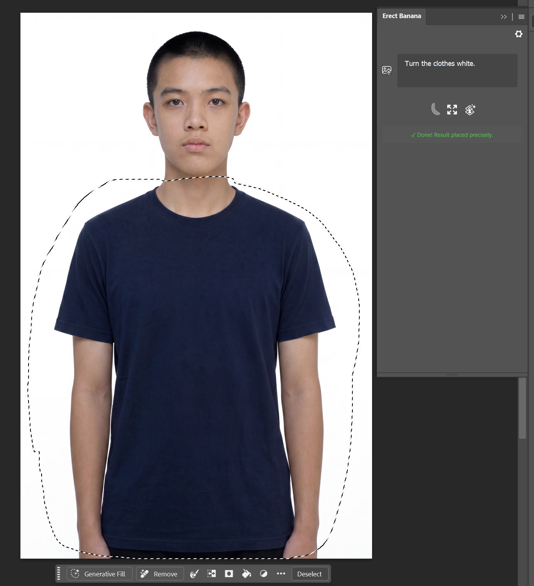
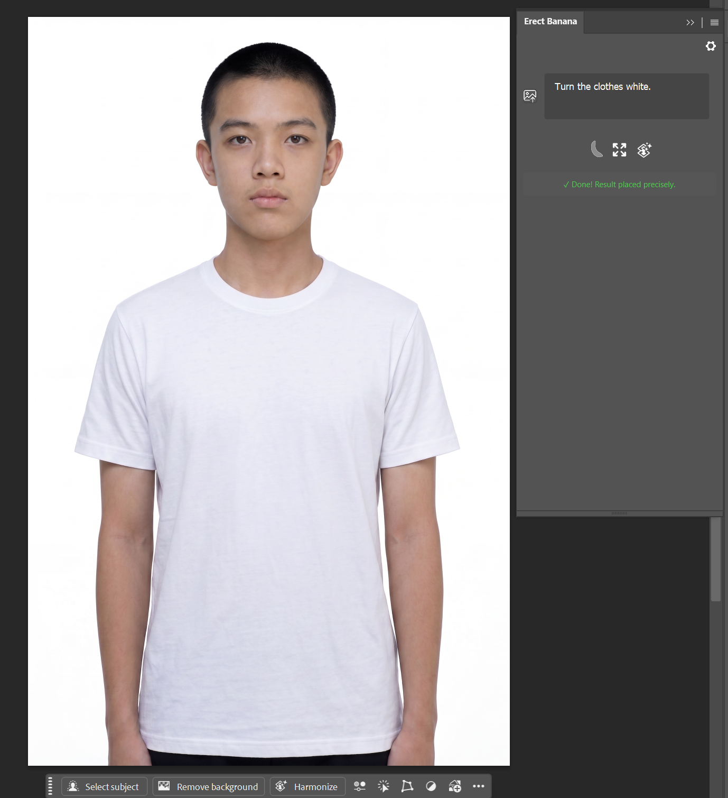
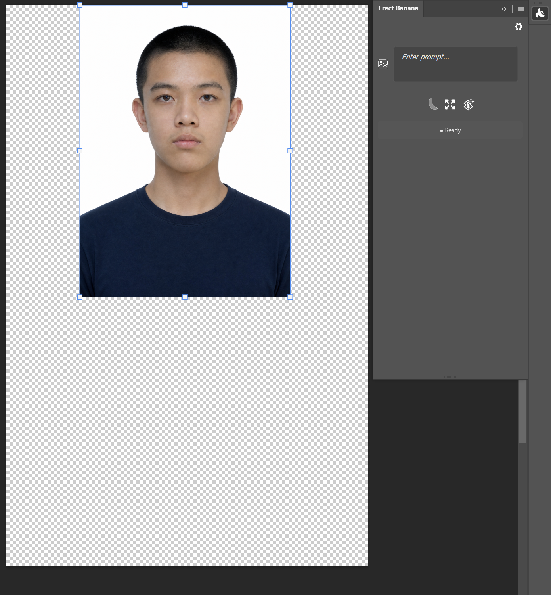
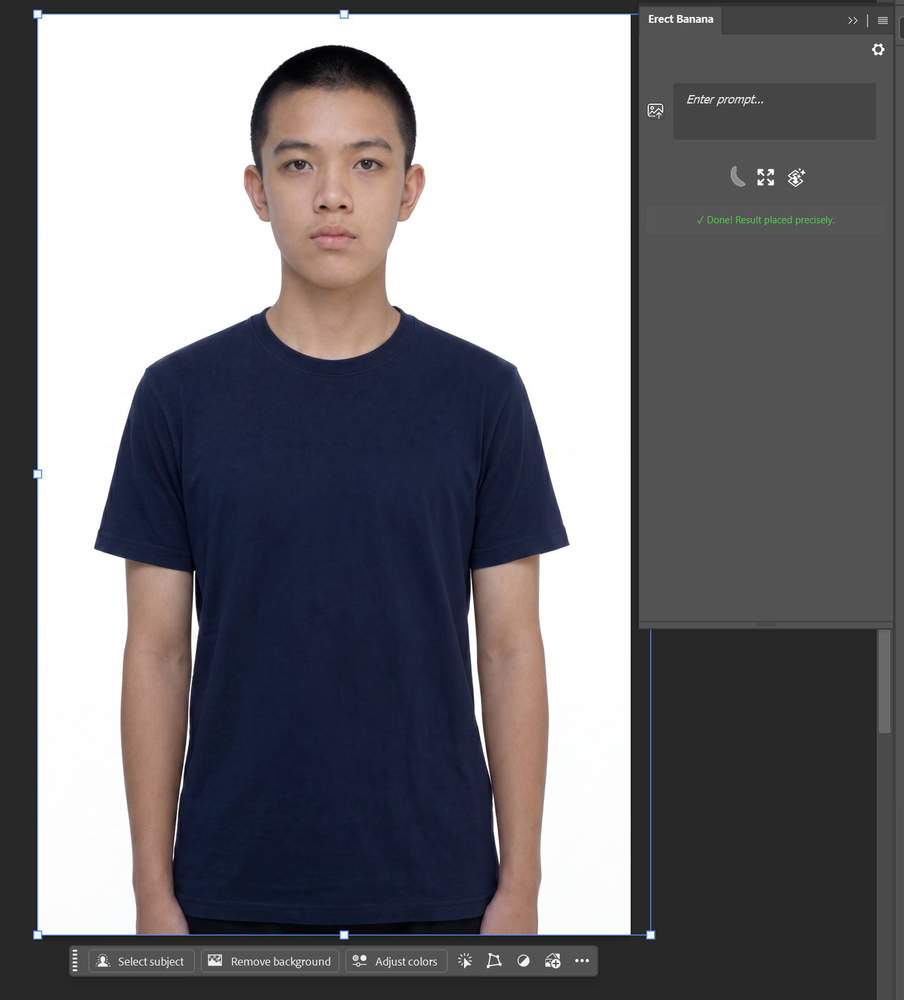
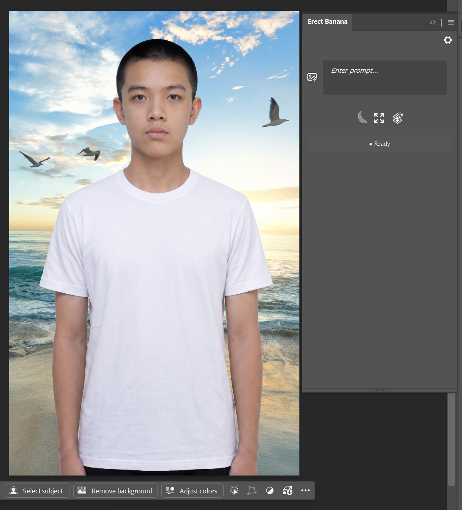
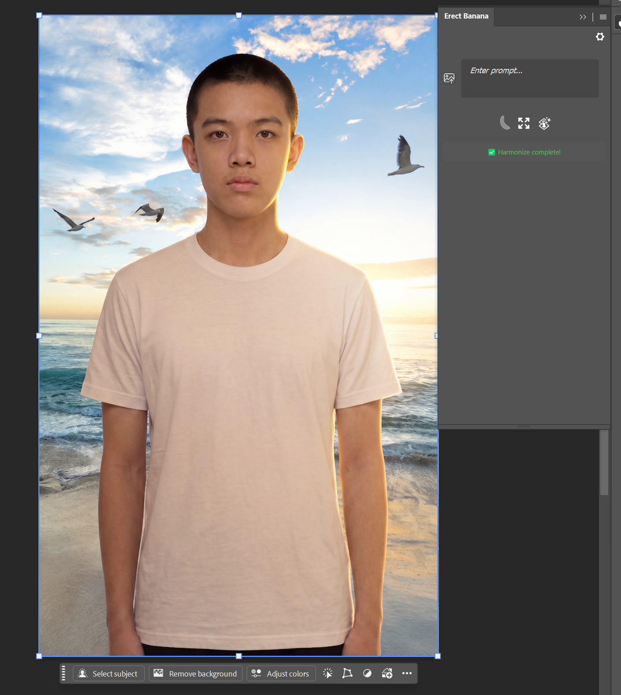

# Erect Banana

**AI Generative Fill, Outpaint & Light Harmonization — natively inside Photoshop.**

[Get it on Adobe Exchange](#) ·
[Email support](mailto:i@shuaige.win)

---

## What it does

Erect Banana brings AI image generation directly into your Photoshop workflow — no app switching, no exporting, no manual uploads.

- **Generative Fill** — make a selection, describe what you want, and the result is composited directly into your layer with automatic feathered-mask blending.

  

    
    
  

- **Outpaint (Extend Canvas)** — extend the canvas in any direction and let AI fill in the new area, preserving the original pixels and matching lighting, perspective, and style.

  

    
    
  

- **Harmonize (Light Matching)** — automatically adjust lighting, color temperature, and shadow direction of a composited layer so it blends naturally into its new background.

  

    
    
  

## Bring your own key (BYOK)

Erect Banana doesn't run its own backend or charge per generation. You connect your own API key from any of:

- **Google AI Studio** (Gemini 2.5 / 3.1 / 3 Pro Image — "Nano Banana" family) — free tier available
- **Google Vertex AI** (for users with their own GCP service account)
- **OpenAI** (GPT-Image-2)
- **OpenRouter** (unified access to Gemini and GPT-Image models through a single key)

Your images go straight from your machine to the provider you choose. Nothing passes through any server operated by the plugin author.

## Requirements

- Adobe Photoshop 24.2 or later (Windows)
- An API key from one of the supported providers above

## Install

Erect Banana is distributed through **Adobe Exchange** — search for "Erect Banana" in the Exchange panel inside Photoshop, or visit the Exchange listing page, and install directly. No separate background service or license key is required.

## Permissions

- **Network access** — sends your selection/canvas to the AI provider you've configured and downloads the generated result.
- **Local file system access** — used to write temporary image files during processing inside Photoshop. Files are cleaned up automatically after each operation.
- **Clipboard read/write** — lets you copy/paste prompts and results between Photoshop and other apps.

## Contact

- **Email**: <i@shuaige.win>
- **Bug reports / feature requests**: [GitHub Issues](https://github.com/shuaige-dev/erect-banana/issues)

## License

MIT
